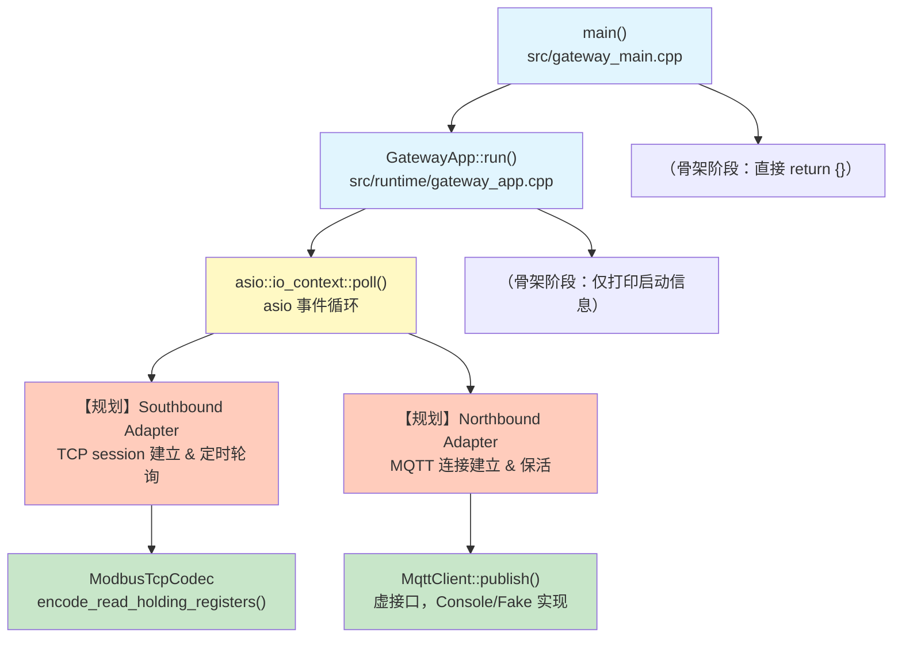
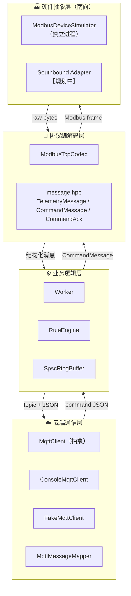
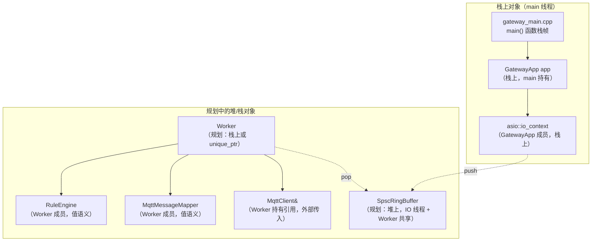

# Edge Gateway 技术深度导航

> **当前项目状态：骨架阶段（Skeleton）**。所有 `.cpp` 函数体已清空，仅保留 `.hpp` 接口定义和 `test_*.cpp` 测试用例壳子。
> 本文档基于头文件接口和 `ARCHITECTURE.md` 架构蓝图编写，标注了哪些路径已实现、哪些仍是规划。

---

## 目录

- [一、核心调用链与数据流向图](#一核心调用链与数据流向图)
- [二、模块职责与依赖表](#二模块职责与依赖表)
- [三、核心对象生存期与线程安全](#三核心对象生存期与线程安全)

---

## 一、核心调用链与数据流向图

### 1.1 main() 启动与初始化（前 3 层）



**颜色说明：**
- 蓝色：入口层（已定义接口，骨架实现）
- 黄色：运行时事件循环
- 橙色：规划中尚未落地的模块
- 绿色：已定义接口且骨架存在的模块

### 1.2 Southbound → Northbound 完整上行数据流

```mermaid
flowchart LR
    S1["Modbus TCP Device / Simulator<br/>（外部进程，端口 1502）"]
    S2["【规划】Southbound Adapter<br/>TCP 读取原始字节流"]
    S3["ModbusTcpCodec::<br/>decode_read_holding_registers_response()"]
    S4["构建 TelemetryMessage<br/>{device_id, points: [{name, value}]}"]
    S5["SpscRingBuffer::push()<br/>IO 线程 → Worker 线程"]
    S6["Worker::process_once()<br/>RuleEngine → Mapper → MqttClient"]
    S7["MqttMessageMapper::<br/>map_telemetry()"]
    S8["MqttClient::publish()<br/>topic + JSON → stdout / broker"]

    S1 -->|"TCP raw bytes"| S2
    S2 -->|"Modbus TCP frame"| S3
    S3 -->|"DecodeResult{registers}"| S4
    S4 -->|"TelemetryMessage"| S5
    S5 -->|"pop by Worker"| S6
    S6 -->|"allowed msg"| S7
    S7 -->|"MqttPublishMessage"| S8

    style S1 fill:#e0e0e0
    style S2 fill:#ffccbc
    style S3 fill:#c8e6c9
    style S4 fill:#c8e6c9
    style S5 fill:#bbdefb
    style S6 fill:#c8e6c9
    style S7 fill:#c8e6c9
    style S8 fill:#c8e6c9
```



**函数跳转顺序（上行关键路径）：**

| 步骤 | 函数 | 所在文件 | 当前状态 |
|------|------|----------|----------|
| 1 | `ModbusTcpCodec::decode_read_holding_registers_response()` | `src/protocol/modbus_tcp_codec.cpp` | 骨架 |
| 2 | 构建 `TelemetryMessage` | 调用方代码（southbound adapter，未实现） | 规划 |
| 3 | `SpscRingBuffer::push()` | `include/gateway/queue/spsc_ring_buffer.hpp` | **完整实现**（header-only） |
| 4 | `SpscRingBuffer::pop()` | 同上 | **完整实现** |
| 5 | `RuleEngine::evaluate()` | `src/rule/rule_engine.cpp` | 骨架 |
| 6 | `MqttMessageMapper::map_telemetry()` | `src/northbound/mqtt_message_mapper.cpp` | 骨架 |
| 7 | `MqttClient::publish()` | `ConsoleMqttClient` / `FakeMqttClient` | 骨架 |

### 1.3 北向命令下发（下行数据流）

```mermaid
flowchart RL
    C1["MqttClient::subscribe()<br/>注册 command topic handler"]
    C2["MqttMessageMapper::<br/>parse_command()"]
    C3["【规划】Command Dispatcher<br/>按 device_id 路由"]
    C4["ModbusTcpCodec::<br/>encode_write_single_register()"]
    C5["【规划】Southbound Adapter<br/>发送 Modbus TCP 请求"]
    C6["构建 CommandAck<br/>status: success/failed"]
    C7["MqttClient::publish()<br/>ack topic + JSON"]

    C1 -->|"JSON payload"| C2
    C2 -->|"CommandMessage"| C3
    C3 -->|"路由"| C4
    C4 -->|"Modbus TCP bytes"| C5
    C5 -->|"device response"| C6
    C6 -->|"CommandAck"| C7

    style C1 fill:#c8e6c9
    style C2 fill:#c8e6c9
    style C3 fill:#ffccbc
    style C4 fill:#c8e6c9
    style C5 fill:#ffccbc
    style C6 fill:#c8e6c9
    style C7 fill:#c8e6c9
```



---

## 二、模块职责与依赖表

项目严格遵循四层分层架构：**硬件抽象层 → 协议编解码层 → 业务逻辑层 → 云端通信层**。

### 2.1 模块职责矩阵

| 分层 | 模块名 | 对外核心函数（≤3） | 依赖的底层模块 | 明确不做的职责（边界） |
|------|--------|---------------------|----------------|------------------------|
| **入口层** | `gateway_main` | `main()` | `GatewayApp` | 不解析命令行参数、不加载配置文件（骨架阶段） |
| **运行时** | `GatewayApp` | `run()` | `asio::io_context` (Asio) | 不管理线程池、不做模块生命周期管理（骨架阶段仅 poll 一次） |
| **运行时** | `Worker` | `process_once()` | `RuleEngine`, `MqttMessageMapper`, `MqttClient&` | 不负责从队列取消息（由外部驱动调用）、不管理自己的线程 |
| **南向模拟** | `ModbusDeviceSimulator` | `run()`, `handle_request()` | `SimulatorConfig` | **不是网关的一部分**——是独立的设备模拟器可执行程序 |
| **协议编解码层** | `ModbusTcpCodec` | `encode_read_holding_registers()`, `encode_write_single_register()`, `decode_read_holding_registers_response()` | 无（纯函数，仅依赖 `std::span` / `std::vector`） | 不做 TCP 网络通信、不做轮询调度、不做寄存器值业务解释 |
| **消息模型层** | `message.hpp` | `to_json(TelemetryMessage)`, `to_json(CommandAck)`, `parse_command(json)` | `nlohmann/json` | 不做 MQTT topic 拼接、不做规则判断、不做网络传输 |
| **队列层** | `SpscRingBuffer` | `push()`, `pop()`, `capacity()` | 无（header-only，仅依赖 `std::atomic`） | 不做动态扩容、不做多生产者多消费者（MPMC）、不做阻塞等待 |
| **业务逻辑层** | `RuleEngine` | `evaluate()` | `TelemetryMessage`, `Rule` | 不做规则持久化、不做 DSL 解析、不做复杂表达式求值 |
| **云端通信层** | `MqttClient`（抽象） | `publish()`, `subscribe()` | 无（纯虚接口） | 不做真实 MQTT 协议实现（CONNECT/SUBACK/PINGREQ 等） |
| **云端通信层** | `ConsoleMqttClient` | `publish()`, `subscribe()` | `MqttClient` | 不做网络传输——仅打印到 stdout |
| **云端通信层** | `FakeMqttClient` | `publish()`, `subscribe()`, `inject_message()` | `MqttClient` | 不做网络传输——仅内存记录，**仅用于单元测试** |
| **云端映射层** | `MqttMessageMapper` | `map_telemetry()`, `parse_command()`, `map_command_ack()` | `core::message.hpp` | 不做实际的 publish/subscribe 调用——只做数据转换 |
| **配置层** | `config.hpp` | `load_gateway_config()`, `load_simulator_config()` | 无（纯数据结构 + 自由函数） | 不做配置热更新、不做配置校验（骨架阶段） |
| **错误层** | `error.hpp` | `to_string(ErrorCode)` | 无（纯枚举） | 不做异常封装、不做错误链（error chain） |

### 2.2 分层架构总览



### 2.3 模块间耦合设计原则

| 原则 | 体现 |
|------|------|
| **依赖倒置** | `Worker` 依赖 `MqttClient&`（抽象引用），不依赖具体 `ConsoleMqttClient` |
| **纯函数 codec** | `ModbusTcpCodec` 所有方法都是 `const`，输入 `span` 输出 `vector`，无副作用 |
| **消息模型为统一语言** | 所有模块间传递 `TelemetryMessage` / `CommandMessage` / `CommandAck` 结构体，JSON 仅在边界使用 |
| **队列解耦生产-消费** | IO 线程和生产、Worker 线程消费通过 `SpscRingBuffer` 解耦，双方互不知晓 |

---

## 三、核心对象生存期与线程安全

### 3.1 当前骨架阶段的对象清单

> **注意：** 当前项目处于骨架阶段，所有 `.cpp` 函数体为空。以下分析基于 `.hpp` 声明和 `ARCHITECTURE.md` 规划。



### 3.2 核心对象生存期明细

| 对象 | 创建时机 | 存储位置 | 析构责任 | 生命周期 |
|------|----------|----------|----------|----------|
| `GatewayApp` | `main()` 函数体开头 | main 栈帧 | 自动析构（离开 main 作用域） | 整个进程生命周期 |
| `asio::io_context` | `GatewayApp` 构造时 | `GatewayApp` 内部成员（栈上） | `GatewayApp` 析构时连带销毁 | 与 `GatewayApp` 一致 |
| `Worker` | 规划：`GatewayApp::run()` 内创建 | 规划：`GatewayApp::run()` 栈帧 或 作为 `GatewayApp` 成员 | 规划：随 `GatewayApp` 或 `run()` 返回析构 | 网关运行期间 |
| `RuleEngine` | `Worker` 构造时，通过参数 move 或默认构造 | `Worker` 内部成员（值语义） | `Worker` 析构时连带销毁 | 与 `Worker` 一致 |
| `MqttMessageMapper` | `Worker` 构造时，通过参数 move | `Worker` 内部成员（值语义） | `Worker` 析构时连带销毁 | 与 `Worker` 一致 |
| `MqttClient&` | 外部创建（`main` 或 `GatewayApp`），引用传入 `Worker` | 引用指向的实体在栈上（如 `ConsoleMqttClient`） | 外部持有者负责——`Worker` **不负责析构** | **必须长于 Worker** |
| `SpscRingBuffer` | 规划：`GatewayApp::run()` 内创建 | 规划：堆上（`shared_ptr`）或栈上（若 IO 线程以 lambda 捕获引用） | 规划：最后一个使用者结束后释放 | 网关运行期间 |
| `ModbusDeviceSimulator` | `simulator_main.cpp` 的 `main()` | main 栈帧 | 自动析构 | **独立进程**，与网关进程无关 |
| `TelemetryMessage` | 每次南向轮询成功时创建 | 栈上临时对象，push 到队列时**拷贝** | 离开作用域自动析构 | 单次遥测周期 |
| `FakeMqttClient` | 测试用例函数体内 | 测试函数栈帧 | 测试结束自动析构 | 单个测试用例 |

### 3.3 三个关键子系统的详细分析

#### 3.3.1 设备上下文对象池（规划阶段）

- **当前状态：** 不存在。`DeviceConfig` 只是配置数据结构。
- **规划方向：** 每个 `device_id` 对应一个 TCP 连接（`ModbusTcpClient` 实例），维护该设备的 transaction_id 计数器、连接状态、重试计时器。
- **建议存储：** `std::unordered_map<std::string, DeviceSession>` 作为 `GatewayApp` 成员。
- **生命周期：** 随网关启动创建，优雅关闭时断开所有 TCP 连接后销毁。

#### 3.3.2 上行消息队列（SpscRingBuffer）

- **当前状态：** **已完整实现**（header-only，`include/gateway/queue/spsc_ring_buffer.hpp`）。
- **实现方式：** 固定容量环形缓冲区，模板参数 `Capacity` 必须是 2 的幂。
- **存储位置：** 规划中——由 `GatewayApp` 创建，IO 线程和 Worker 线程各持有一个引用/指针。
- **线程安全机制：**

```
                  SpscRingBuffer 并发模型

   Producer (IO Thread)              Consumer (Worker Thread)
          │                                    │
          │ push(item)                         │ pop(item)
          ▼                                    ▼
   ┌──────────────┐                   ┌──────────────┐
   │ tail_.load() │  ← memory_order   │ head_.load() │
   │   relaxed    │       ──          │   relaxed    │
   └──────┬───────┘       │          └──────┬───────┘
          │               │                 │
          ▼               │                 ▼
   ┌──────────────┐       │          ┌──────────────┐
   │ head_.load() │       │          │ tail_.load() │
   │  acquire     │  ← 同步屏障 →    │  acquire     │
   └──────┬───────┘       │          └──────┬───────┘
          │               │                 │
          ▼               │                 ▼
   ┌──────────────┐       │          ┌──────────────┐
   │ buffer_[idx] │       │          │ buffer_[idx] │
   │   = item     │       │          │   → item     │
   └──────┬───────┘       │          └──────┬───────┘
          │               │                 │
          ▼               │                 ▼
   ┌──────────────┐       │          ┌──────────────┐
   │ tail_.store()│       │          │ head_.store()│
   │   release    │  ──   │          │   release    │
   └──────────────┘       │          └──────────────┘
```

| 特性 | 说明 |
|------|------|
| **算法** | 经典 Lamport 风格的 SPSC 无锁环形队列 |
| **同步机制** | `std::atomic<std::size_t>` + acquire/release 内存序，**无互斥锁、无自旋锁** |
| **Cache Line 隔离** | `head_` 和 `tail_` 各自 `alignas(64)`，防止 false sharing |
| **容量** | `Capacity - 1` 个实际可用槽位（保留一个槽位区分空/满） |
| **满处理** | `push()` 返回 `false`，调用方负责丢弃/计数/日志——**永不阻塞** |
| **空处理** | `pop()` 返回 `false`，调用方自行决定轮询策略 |
| **线程约束** | **严格单生产者 + 单消费者（SPSC）**，多生产者或多消费者会导致数据竞争 |

#### 3.3.3 配置管理

- **当前状态：** 定义了两个自由函数 `load_gateway_config()` 和 `load_simulator_config()`，**但无 .cpp 实现**（骨架）。
- **存储方式：** 返回纯值类型 `GatewayConfig` / `SimulatorConfig`（栈上结构体，无单例模式）。
- **线程安全：** 配置在启动时一次性加载，运行期只读——**天然线程安全**，无需锁。

### 3.4 多线程并发访问汇总

| 对象 | 被哪些线程访问 | 锁/同步机制 | 风险点 |
|------|---------------|-------------|--------|
| `SpscRingBuffer` | IO 线程（写）+ Worker 线程（读） | **无锁**（atomic acquire/release） | 违反 SPSC 约束会导致数据竞争 |
| `FakeMqttClient::published_messages_` | **仅测试主线程** | **无锁**（仅单线程使用） | 多线程测试时需加 `std::mutex` |
| `FakeMqttClient::handlers_` | **仅测试主线程** | **无锁** | 同上 |
| `ConsoleMqttClient::handlers_` | 规划：IO 线程 | **无锁**（当前无并发） | subscribe 和 inject 并发时需要 mutex |
| `RuleEngine::rules_` | Worker 线程读取 | **不可变对象**（构造后不修改） | 无风险 |
| `MqttMessageMapper::gateway_id_` | Worker 线程读取 | **不可变对象** | 无风险 |
| `GatewayConfig` | main 线程写入，各模块只读 | **无锁**（启动时一次性初始化） | 无风险 |
| `asio::io_context` | IO 线程 | Asio 内部线程安全 | 仅从单线程调用 `run()` / `poll()` |

### 3.5 骨架阶段 vs 完整实现对比

| 维度 | 骨架阶段（当前） | 完整实现（规划） |
|------|------------------|------------------|
| 线程数 | 1（main） | 2（1 IO + 1 Worker） |
| 队列 | `SpscRingBuffer` 已实现，但未接入 | 接入 southbound → worker 数据通路 |
| TCP 连接 | 无 | `asio::ip::tcp::socket` |
| 对象池 | 不存在 | `DeviceSession` map |
| 析构顺序 | 不涉及 | IO 线程先停 → 队列 drain → Worker 线程 join → MQTT disconnect |
| 错误恢复 | 无 | 连接断开重试、队列满丢弃计数 |

---

*文档生成于 2026-07-11，基于项目骨架阶段的头文件和 ARCHITECTURE.md 架构蓝图。*
